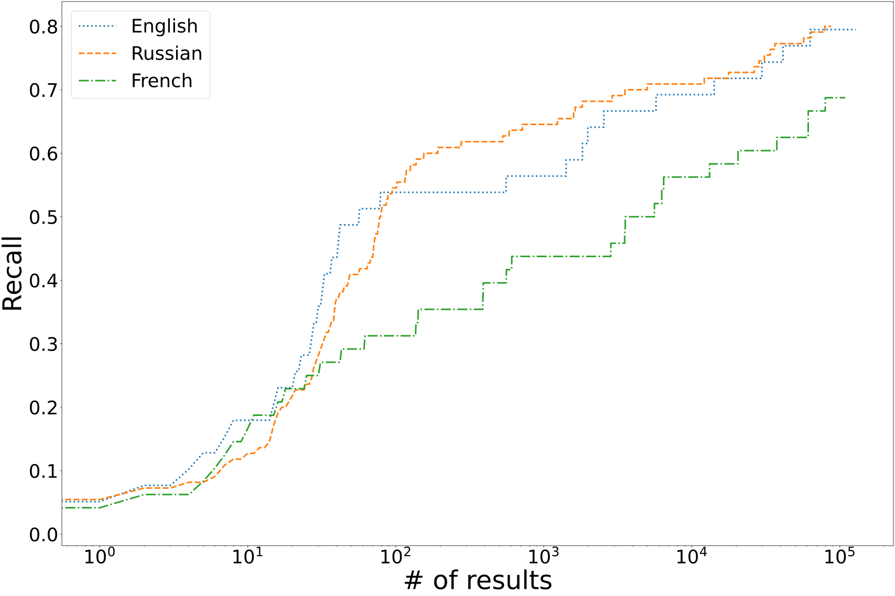

# Acrostic Identification Dataset

**Acrostic Identification Dataset (AcrostID)** is a curated collection of acrostics from the English, Russian, and French subdomains of the WikiSource database.
The dataset is intended for evaluation of tools such as [AcrosticSleuth](https://github.com/acrostics/acrostic-sleuth), which aim to identify acrostics from large corpora of texts.
You can read more about the methodology in our upcoming paper ([link to preprint](https://doi.org/10.48550/arXiv.2408.04427)).

### Table of Contents

- [What does this repository contain?](#what-does-this-repository-contain)
- [Installation and usage](#installation-and-usage)
- [Categories of acrostics](#categories-of-acrostics)
- [What is the state-of-the-art result?](#what-is-the-state-of-the-art-result)
- [How to cite this](#how-to-cite-this)

## What does this repository contain?

This repository contains the following:
- `get_data.sh` -- a bash script that downloads and preprocesses the exact versions of WikiSource subdomain backup dumps that have been used during the dataset curation.
The script uses [wikiextractor](https://github.com/acrostics/wikiextractor) (included as a submodule) to clean and preprocess the raw XML files.
Since WikiSource evolves constantly, it is preferable that any tool that is evaluated on AcrostID uses these specific versions of WikiSource and preprocess them using `wikiextractor`.
- `labels` -- the directory with the acrostics proper.
Each file corresponds to a language subdomain.
Each line in a file is a tab-separated tuple, where the first element
is a collection of abbreviations that categorize the acrostic (see [Categories of Acrostics](#categories-of-acrostics)), the second element is the acrostic itself, 
and the third element is the name of the WikiSource page that the acrostic comes from.
- `scorer.py` -- a file that takes in a list of predictions produced by an acrostic identification tool and reports how recall changes with the number of results.
This script should be used to evaluate future acrostic identification tools.

## Installation and usage

Note that you might need over 60 GB of free disk space, a fast internet connection, and up to several hours of your time to download and preprocess the WikiSource backup dumps.
We strongly recommend using Mac OS or Ubuntu when working with the dataset.

First, make sure that you clone this directory with the `--recursive` flag, so that it also includes the necessary submodules.
While these typically are preinstalled on Linux and Mac OS machines, you will need `curl`, `bzip2`, and `python3` throughout this process.
Your python environment must also have `pylcs`, `numpy`, and `matplotlib` installed (`pip3 install pylcs numpy matplotlib`)

To download and preprocess the complete WikiSource dumps, run the `./get_data.sh` script.
These will include:
- [April 20th 2024 dump of the English WikiSource](https://dumps.wikimedia.org/enwikisource/20240420/enwikisource-20240420-pages-meta-current.xml.bz2)
- [May 1st 2024 dump of the French WikiSource](https://dumps.wikimedia.org/frwikisource/20240501/frwikisource-20240501-pages-meta-current.xml.bz2)
- [May 1st 2024 dump of the Russian WikiSource](https://dumps.wikimedia.org/ruwikisource/20240501/ruwikisource-20240501-pages-meta-current.xml.bz2)

To score a tool's predictions against the manually created labels, use the `scorer.py` script.
The script will produce a figure that plots recall\precision\f1 vs # of results, like you see below ([What is the state-of-the-art result?](#what-is-the-state-of-the-art-result)).
The first argument should be the name of the metric to plot, and the second argument should be the name of the figure to be created.
The script then accepts an arbitrary number of 4-element comma-separated tuples, where each tuple consists of 
(i) language code, (ii) label file from this repository, (iii) file with predictions, and (iv) name of the comparison

For example, to produce the figure below, we have run the following command (where predictions in the output directory are produced by AcrosticSleuth):

```bash
python3 scorer.py recall RecallFigure.png EN,labels/en.tsv,../../output/en.tsv,English RU,labels/ru.tsv,../../output/ru.tsv,Russian FR,labels/fr.tsv,../../output/fr.tsv,French
```

## Categories of acrostics

The following is a list of abbreviations/labels we use to categorize acrostics.

Acrostics that are counted towards recall and precision (unless also marked with i, n, w, e, o, or a number, in which case see below):
- m is for "mentioned" -- an acrostic explicitly referenced as such on WikiSource.
- f is for "formated" -- an acrostic formatted as such on WikiSource (initial letters of a poem are highlighted in red, rotated by 90 degrees, etc.)

Acrostics that are counted towards precision but not recall (unless also marked w, e, o, or a number, in which case see below):
- i is for "international" -- acrostic in a language that is different from the base language of the text. 
- t is for "tool" -- acrostic found by AcrosticSleuth (but not explicitly referred to or mentioned on WikiSource as an acrostic)
Such acrostics should not be counted towards the tool's recall but could be counted toward precision.
- n is for "not a true acrostic" -- an acrostic erroneously created during OCR.
Often this happens when the source text has a table with a vertical entry.
Such "acrostics" should not be counted towards the tool's recall but could be counted toward precision.

Acrostics that are not counted towards either precision or recall:
- 2,3,4,6,8, etc. identify acrostics formed by every second/third/etc. letter of each line
- w is for "word-level" acrostic
- e is for "end" acrostic aka telestic
- o is for "omitted" -- a page that exists in a .djvu file and might be added to WikiSource in the future but is not present in the backup dump used to create the dataset.

Additional labels:
- s is for "split" -- this abbreviation is used to identify separate acrostics that should be counted as one when calculating recall.
This happens when either of the following is true:
(i) a single acrostic is split between multiple WikiSource pages,
(ii) two separate acrostics are located very close to each other on the same WikiSource page (we chose to use within 10 lines as the criterion), or
(iii) the same acrostic poem is reproduced multiple times on different WikiSource pages. 
During evaluation, all such "split" acrostics are counted as a single acrostic when calculating recall.

The figure below outlines the methods by which acrostics were collected to form AcrostID:


## What is the state of the art result?

[AcrosticSleuth](https://github.com/acrostics/acrostic-sleuth) reaches recall of over 50% within the first 100 results for English and Russian, and recall rises to up to 80% when considering more results.
Read more in our paper ([link to preprint](https://doi.org/10.48550/arXiv.2408.04427)):



## How to cite this?

Fedchin, A., Cooperman, I., Chaudhuri, P., Dexter, J.P. 2024 "AcrosticSleuth: Probabilistic Identification and Ranking of Acrostics in Multilingual Corpora". https://doi.org/10.48550/arXiv.2408.04427
